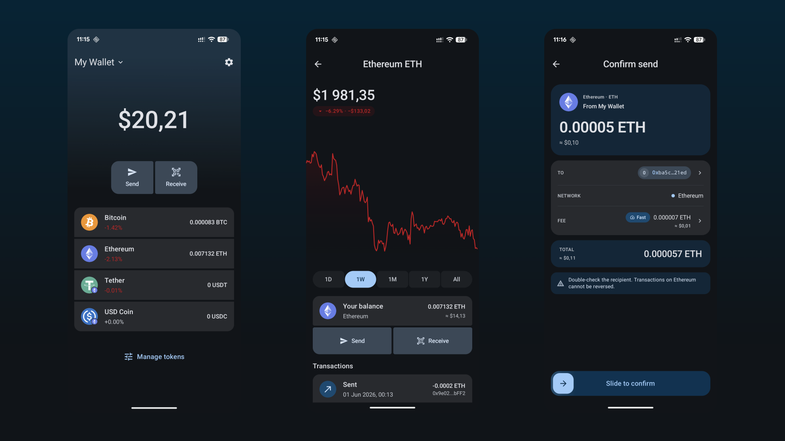

# Fortera

**Fortera** is a modern, secure, non-custodial multi-blockchain wallet for Android. Bitcoin, Ethereum, and ERC-20 tokens live together in one app—and your recovery phrase never leaves your device.

## Key Features

### Main
- **Non-Custodial by Design**  
  No accounts, no servers holding your funds—nobody can freeze or move your assets  
- **On-Device Key Management**  
  An HD wallet is derived from a 12-word mnemonic following the BIP standards; keys are generated and stored only on your phone  
- **Seed Phrase Isolation**  
  The recovery phrase lives in encrypted storage and never reaches the UI layer or the network  

### Multi-Blockchain Support
- **Bitcoin & Ethereum**  
  Manage native BTC and ETH from a single wallet  
- **ERC-20 Tokens**  
  Add and track any ERC-20 token on top of Ethereum  
- **Mainnet & Testnet**  
  Switch environments for real funds or safe testing  

### Wallet Setup in Seconds
- **Create a Wallet**  
  Generate a fresh wallet and back up your recovery phrase  
- **Import a Wallet**  
  Restore an existing wallet from its 12-word mnemonic  
- **Multiple Wallets**  
  Keep several wallets and switch between them instantly  

### Balances & Market Data
- **Reactive Balances**  
  A live balance stream that updates as data arrives, with caching for instant cold starts  
- **Live Prices**  
  Fiat valuation for every asset in your portfolio  
- **Interactive Charts**  
  Historical price charts on the token details screen  

### Send & Receive
- **Receive with QR**  
  Share your address as a scannable QR code  
- **Built-In QR Scanner**  
  Scan a recipient address straight from the camera  
- **Send Transactions**  
  Sign and broadcast on both the Ethereum and Bitcoin networks, with a confirmation step before anything leaves your wallet  

### Security
- **Biometric Lock**  
  Protect the app with fingerprint or face unlock  
- **Encrypted Storage**  
  Secrets are kept in EncryptedSharedPreferences, backed by the Android Keystore  
- **Hardened Release Build**  
  Production builds are minified and resource-shrunk with R8/ProGuard  

Fortera brings multi-chain self-custody to your pocket—your assets, your keys, one app.  

# Screenshots

## Technology Stack

- Jetpack Compose  
- Kotlin  
- MVI  
- Koin  
- Coil  
- Room  
- DataStore Preferences  
- Ktor  
- Navigation 3  
- Material 3  
- Kotlinx Serialization  
- web3j (Ethereum)  
- bitcoinj (Bitcoin)  
- BouncyCastle  
- kotlin-bip39 (HD wallet)  
- ZXing + CameraX (QR)  
- TradingView Lightweight Charts  
- EncryptedSharedPreferences  
- AndroidX Biometric  
